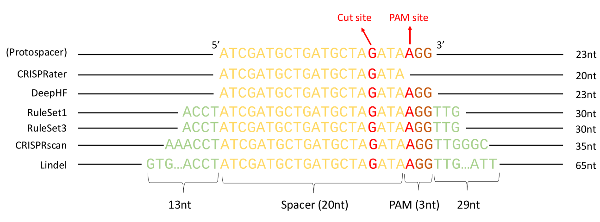
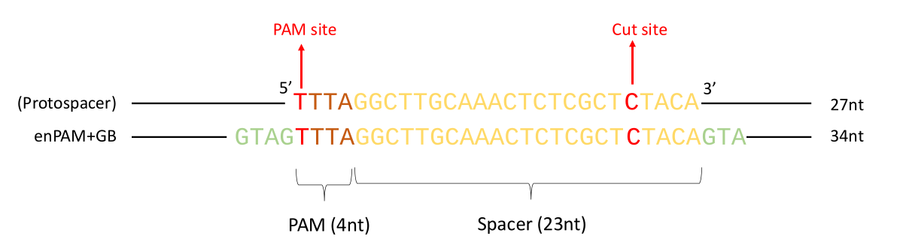

```{r, echo=FALSE, results="hide"}
options("knitr.graphics.auto_pdf"=TRUE)
```

Authors: Jean-Philippe Fortin, Aaron Lun, Luke Hoberecht, Pirunthan Perampalan

Date: Nov 20, 2025

# Overview

The `crisprScore` package provides R wrappers of several on-target and off-target scoring
methods for CRISPR guide RNAs (gRNAs). The following nucleases are supported:
SpCas9, AsCas12a, enAsCas12a, and RfxCas13d (CasRx). The available on-target
cutting efficiency scoring methods are RuleSet1, RuleSet3, DeepHF, 
enPAM+GB, CRISPRscan and CRISPRater. Both the CFD and MIT
scoring methods are available for off-target specificity prediction. The
package also provides a Lindel-derived score to predict the probability
of a gRNA to produce indels inducing a frameshift for the Cas9 nuclease.
Note that DeepHF and enPAM+GB are not available on Windows machines. 

Our work is described in a recent bioRxiv preprint:
["The crisprVerse: A comprehensive Bioconductor ecosystem for the design of CRISPR guide RNAs across nucleases and technologies"](https://www.biorxiv.org/content/10.1101/2022.04.21.488824v3)

Our main gRNA design package [crisprDesign](https://github.com/crisprVerse/crisprDesign) utilizes the `crisprScore` package to add on- and off-target scores to user-designed gRNAs; check out our [Cas9 gRNA tutorial page](https://github.com/crisprVerse/Tutorials/tree/master/Design_CRISPRko_Cas9) to learn how to use `crisprScore` via `crisprDesign`. 

# Installation and getting started

## Software requirements

### OS Requirements

This package is supported for macOS, Linux and Windows machines.
Some functionalities are not supported for Windows machines.
Packages were developed and tested on R version 4.2.


## Installation from Bioconductor

`crisprScore` can be installed from from the Bioconductor devel branch
using the following commands in a fresh R session:

```{r, eval=FALSE}
if (!require("BiocManager", quietly = TRUE))
    install.packages("BiocManager")

BiocManager::install(version="devel")
BiocManager::install("crisprScore")
```

## Installation from GitHub

Alternatively, the development version of `crisprScore` and its dependencies can be installed by typing the following commands inside of an R session:


```r
install.packages("devtools")
library(devtools)
install_github("crisprVerse/crisprScoreData")
install_github("crisprVerse/crisprScore")
```

Note that RStudio users will need to add the following line to their `.Rprofile`
file in order for `crisprScore` to work properly:

```{r, eval=FALSE}
options(reticulate.useImportHook=FALSE)
```

# Python scoring algorithms 

`crisprScore` used to rely on the `basilisk` Bioconductor package to maintain
and install the conda environments necessary to run the different scoring
algorithms written in Python. However, due to recent changes to `basilisk` and
the `reticulate` package, the changes in the conda licensing, the deprecation of 
Python 2, and the arrival of Apple Silicon, it has become increasingly difficult
for us to resolve those environments automatically across machines and scoring
algorithms.

As a result, we have made the following two decisions: 

(1) scoring algorithms written in Python 2
are no longer supported by `crisprScore`; this includes Azimuth, DeepCpf1, 
DeepSpCas9, and CRISPRai. The more recent and more performant RuleSet3 and 
DeepHF scoring algorithms can be used instead of Azimuth, and the enPam+GB 
algorithm can be used instead of DeepCpf1. While `crisprScore` does not 
implement any CRISPRa or CRISPRi-specific scoring algorithms, we have found
that the DeepHF algorithm works well at predicting CRISPRa and CRISPRi gRNAs. 

(2) users now have to build the conda environments themselves prior to using
`crisprScore`, and pass the conda environment path to the different scoring
algorithms. See next section. 

# Installing conda environments

For each of the Python scoring algorithms implemented in `crisprScore`,
we provide in the crisprScore/inst/python folder a script to install
the conda environments: `buildingCondaEnvironments.sh`.

The script assumes that a conda instance is available on path.
We recommend using miniforge: https://github.com/conda-forge/miniforge to 
install and manage conda environments. 

We use the following conda channel specifications in the .condarc file:

```
channels:
  - conda-forge
  - bioconda
  - defaults
channel_priority: strict
```


# Getting started

We load `crisprScore` in the usual way:

```{r, warnings=FALSE, message=FALSE}
library(crisprScore)
```

The `scoringMethodsInfo` data.frame contains a succinct summary of scoring
methods available in `crisprScore`: 

```{r}
data(scoringMethodsInfo)
print(scoringMethodsInfo)
```

Each scoring algorithm requires a different contextual nucleotide sequence.
The `left` and `right` columns indicates how many nucleotides upstream 
and downstream of the first nucleotide of the PAM sequence are needed for 
input, and the `len` column indicates the total number of nucleotides needed
for input. The `crisprDesign` [(GitHub link)](https://github.com/Jfortin1/crisprDesign)
package provides user-friendly functionalities to extract and score those
sequences automatically via the `addOnTargetScores` function.

# On-targeting efficiency scores 

Predicting on-target cutting efficiency is an extensive area of research, and 
we try to provide in `crisprScore` the latest state-of-the-art algorithms as 
they become available. 

## Cas9 methods

Different algorithms require different input nucleotide 
sequences to predict cutting efficiency as illustrated in the figure below.

```{r, echo=FALSE,fig.cap="Sequence inputs for Cas9 scoring methods"}

```


### Rule Set 1 

The Rule Set 1 algorithm is one of the first on-target efficiency methods
developed for the Cas9 nuclease [@ruleset1]. It generates a probability
(therefore a score between 0 and 1) that a given sgRNA will cut at its
intended target. 4 nucleotides upstream and 3 nucleotides downstream of
the PAM sequence are needed for scoring:

```{r, eval=TRUE}
flank5 <- "ACCT" #4bp
spacer <- "ATCGATGCTGATGCTAGATA" #20bp
pam    <- "AGG" #3bp 
flank3 <- "TTG" #3bp
input  <- paste0(flank5, spacer, pam, flank3) 
results <- getRuleSet1Scores(input)
```


### Rule Set 3 

The Rule Set 3 is an improvement over Rule Set 1 and Rule Set 2/Azimuth
developed for the SpCas9 nuclease, taking into account the type of
tracrRNAs [@ruleset3]. Two types of tracrRNAs are currently offered:

```
GTTTTAGAGCTA-----GAAA-----TAGCAAGTTAAAAT... --> Hsu2013 tracrRNA
GTTTAAGAGCTATGCTGGAAACAGCATAGCAAGTTTAAAT... --> Chen2013 tracrRNA
```

Similar to Rule Set 1 and Azimuth, the input sequence requires  4 nucleotides
upstream of the protospacer sequence, the protospacer sequence itself
(20nt spacersequence and PAM sequence), and 3 nucleotides downstream of
the PAM sequence:

```{r, eval=FALSE}
flank5 <- "ACCT" #4bp
spacer <- "ATCGATGCTGATGCTAGATA" #20bp
pam    <- "AGG" #3bp 
flank3 <- "TTG" #3bp
input  <- paste0(flank5, spacer, pam, flank3) 
```

We specify the path of the conda environment necessary to run the python
code and run the results:

```{r, eval=FALSE}
condaEnv <- "/Users/fortin946/miniforge3/envs/rs3-env"
results <- getRuleSet3Scores(input, tracrRNA="Hsu2013", condaEnv=condaEnv)
```


A more involved version of the algorithm takes into account gene context of 
the target protospacer sequence (Rule Set 3 Target) and will be soon 
implemented in `crisprScore`. 


### DeepHF 

The DeepHF algorithm is an on-target cutting efficiency prediction algorithm for
several variants of the Cas9 nuclease [@deepcas9] using a recurrent neural 
network (RNN) framework. Similar to the Azimuth score, it generates a 
probability of cutting at the intended on-target. The algorithm only needs 
the protospacer and PAM sequences as inputs:


```{r, eval=FALSE}
spacer  <- "ATCGATGCTGATGCTAGATA" #20bp
pam     <- "AGG" #3bp 
input   <- paste0(spacer, pam) 
condaEnv <- "/Users/fortin946/miniforge3/envs/deephf-env"
results <- getDeepHFScores(input, condaEnv=condaEnv)
```

Users can specify for which Cas9 they wish to score sgRNAs by using the argument
`enzyme`: "WT" for Wildtype Cas9 (WT-SpCas9), "HF" for high-fidelity Cas9 
(SpCas9-HF), or "ESP" for enhancedCas9 (eSpCas9). For wildtype Cas9, users can
also specify the promoter used for expressing sgRNAs using the argument 
`promoter` ("U6" by default). See `?getDeepHFScores` for more details.


### CRISPRscan

The CRISPRscan algorithm, also known as the Moreno-Mateos score, is an
on-target efficiency method for the SpCas9 nuclease developed for sgRNAs
expressed from a T7 promoter, and trained on zebrafish data [@crisprscan].
It generates a probability (therefore a score between 0 and 1) that a given
sgRNA will cut at its intended target. 
6 nucleotides upstream of the protospacer sequence
and 6 nucleotides downstream of the PAM sequence are needed for scoring:

```{r, eval=TRUE}
flank5 <- "ACCTAA" #6bp
spacer <- "ATCGATGCTGATGCTAGATA" #20bp
pam    <- "AGG" #3bp 
flank3 <- "TTGAAT" #6bp
input  <- paste0(flank5, spacer, pam, flank3) 
results <- getCRISPRscanScores(input)
```


### CRISPRater 

The CRISPRater algorithm is an on-target efficiency method for the SpCas9 nuclease [@crisprater].
It generates a probability (therefore a score between 0 and 1) that a given
sgRNA will cut at its intended target. 
Only the 20bp spacer sequence is required.

```{r, eval=TRUE}
spacer <- "ATCGATGCTGATGCTAGATA" #20bp
results <- getCRISPRaterScores(spacer)
```


## Cas12a methods

Different algorithms require different input nucleotide 
sequences to predict cutting efficiency as illustrated in the figure below.

```{r, echo=FALSE, fig.cap="Sequence inputs for Cas12a scoring methods"}

```

### enPAM+GB score 

The enPAM+GB algorithm is an on-target cutting efficiency prediction algorithm 
for the enhanced Cas12a (enCas12a) nuclease [@enpamgb] using a gradient-booster
(GB) model. The enCas12a nuclease as an extended set of active PAM sequences in
comparison to the wildtype Cas12 nuclease [@encas12a], and the enPAM+GB 
algorithm takes PAM activity into account in the calculation of the final score.
It generates a probability (therefore a score between 0 and 1) of a given sgRNA 
to cut at the intended target. 4 nucleotides upstream of the PAM
sequence, and 3 nucleotides downstream of the protospacer
sequence are needed for scoring:


```{r, eval=FALSE}
flank5 <- "ACCG" #4bp
pam    <- "TTTT" #4bp
spacer <- "AATCGATGCTGATGCTAGATATT" #23bp
flank3 <- "AAG" #3bp
input  <- paste0(flank5, pam, spacer, flank3) 
condaEnv <- "/Users/fortin946/miniforge3/envs/enpamgb-env"
results <- getEnPAMGBScores(input, condaEnv=condaEnv)
```


## Cas13d methods

### CasRxRF 

The CasRxRF method was developed to characterize on-target efficiency of the RNA-targeting nuclease RfxCas13d, abbreviated as CasRx [@casrxrf].

It requires as an input the mRNA sequence targeted by the gRNAs, and returns as an output on-target efficiency scores for all gRNAs targeting the mRNA sequence.

As an example, we predict on-target efficiency for gRNAs targeting the mRNA sequence stored in the file `test.fa`:


```{r, eval=FALSE}
fasta <- file.path(system.file(package="crisprScore"),
                   "casrxrf/test.fa")
mrnaSequence <- Biostrings::readDNAStringSet(filepath=fasta
                                             format="fasta",
                                             use.names=TRUE)
results <- getCasRxRFScores(mrnaSequence)
```


Note that the function has a default argument `directRepeat` set to `aacccctaccaactggtcggggtttgaaac`, specifying the direct repeat used in the
CasRx construct (see [@casrxrf].) The function also has an argument `binaries`
that specifies the file path of the binaries for three 
programs necessary by the CasRxRF algorithm:

- `RNAfold`: available as part of the ViennaRNA package
- `RNAplfold`: available as part of the ViennaRNA package
- `RNAhybrid`: available as part of the RNAhybrid package

Those programs can be installed from their respective websites: [VienneRNA](https://www.tbi.univie.ac.at/RNA/) and [RNAhybrid](https://bibiserv.cebitec.uni-bielefeld.de/rnahybrid/).

If the argument is `NULL`, the binaries are assumed to be available on
the PATH. 


# Off-target specificity scores 

For CRISPR knockout systems, off-targeting effects can occur when the CRISPR 
nuclease tolerates some levels of imperfect complementarity between gRNA spacer
sequences and protospacer sequences of the targeted genome. Generally, a greater
number of mismatches between spacer and protospacer sequences decreases the 
likelihood of cleavage by a nuclease, but the nature of the nucleotide
substitution can module the likelihood as well. Several off-target specificity
scores were developed to predict the likelihood of a nuclease to cut at an 
unintended off-target site given a position-specific set of nucleotide 
mismatches. 

We provide in `crisprScore` two popular off-target specificity scoring
methods for CRISPR/Cas9 knockout systems: the MIT score [@mit] and the
cutting frequency determination (CFD) score [@azimuth].

## MIT score 

The MIT score was an early off-target specificity prediction algorithm developed
for the CRISPR/Cas9 system [@mit]. It predicts the likelihood that the Cas9 
nuclease will cut at an off-target site using position-specific mismatch 
tolerance weights. It also takes into consideration the total number of 
mismatches, as well as the average distance between mismatches.
However, it does not take into account the nature of the nucleotide
substitutions. The exact formula used to estimate the cutting likelihood is

$$\text{MIT} = \biggl(\prod_{p \in
M}{w_p}\biggr)\times\frac{1}{\frac{19-d}{19}\times4+1}\times\frac{1}{m^2}$$

where $M$ is the set of positions for which there is a mismatch between the 
sgRNA spacer sequence and the off-target sequence, $w_p$ is an 
experimentally-derived mismatch tolerance weight at position $p$, $d$ is the 
average distance between mismatches, and $m$ is the total number
of mismatches. As the number of mismatches increases, the cutting 
likelihood decreases.  In addition, off-targets with more adjacent mismatches
will have a lower cutting likelihood. 

The `getMITScores` function takes as argument a character vector of 20bp 
sequences specifying the spacer sequences of sgRNAs (`spacers` argument), as 
well as a vector of 20bp sequences representing the protospacer sequences of the putative off-targets in the targeted 
genome (`protospacers` argument). PAM sequences (`pams`) must also be provided. If only one spacer sequence is provided,
it will reused for all provided protospacers. 

The following code will generate MIT scores for 3 off-targets with respect to 
the sgRNA `ATCGATGCTGATGCTAGATA`:

```{r}
spacer   <- "ATCGATGCTGATGCTAGATA"
protospacers  <- c("ACCGATGCTGATGCTAGATA",
                   "ATCGATGCTGATGCTAGATT",
                   "ATCGATGCTGATGCTAGATA")
pams <- c("AGG", "AGG", "AGA")
getMITScores(spacers=spacer,
             protospacers=protospacers,
             pams=pams)
```


## CFD score 

The CFD off-target specificity prediction algorithm was initially developed for 
the CRISPR/Cas9 system, and was shown to be superior to the MIT score 
[@azimuth]. Unlike the MIT score, position-specific mismatch weights vary 
according to the nature of the nucleotide substitution (e.g. an A->G mismatch at
position 15 has a different weight than an A->T mismatch at position 15). 

Similar to the `getMITScores` function, the `getCFDScores` function takes as 
argument a character vector of 20bp sequences specifying the spacer sequences of
sgRNAs (`spacers` argument), as well as a vector of 20bp sequences representing
the protospacer sequences of the putative 
off-targets in the targeted genome (`protospacers` argument). 
`pams` must also be provided. 
If only one spacer
sequence is provided, it will be used for all provided protospacers. 

The following code will generate CFD scores for 3 off-targets with respect to 
the sgRNA `ATCGATGCTGATGCTAGATA`:


```{r}
spacer   <- "ATCGATGCTGATGCTAGATA"
protospacers  <- c("ACCGATGCTGATGCTAGATA",
                   "ATCGATGCTGATGCTAGATT",
                   "ATCGATGCTGATGCTAGATA")
pams <- c("AGG", "AGG", "AGA")
getCFDScores(spacers=spacer,
             protospacers=protospacers,
             pams=pams)
```


# Indel prediction score 

## Lindel score (Cas9)

Non-homologous end-joining (NHEJ) plays an important role in double-strand break
(DSB) repair of DNA. Error patterns of NHEJ can be strongly biased by sequence 
context, and several studies have shown that microhomology can be used to 
predict indels resulting from CRISPR/Cas9-mediated cleavage. Among other useful 
metrics, the frequency of frameshift-causing indels can be estimated for a given
sgRNA. 

Lindel [@lindel] is a logistic regression model that was trained to use local
sequence context to predict the distribution of mutational outcomes. 
In `crisprScore`, the function `getLindelScores` return the proportion of 
"frameshifting" indels estimated by Lindel. By chance, assuming a random 
distribution of indel lengths, frameshifting proportions should be roughly 
around 0.66. A Lindel score higher than 0.66 indicates a higher than by chance
probability that a sgRNA induces a frameshift mutation. 

The Lindel algorithm requires nucleotide context around the protospacer 
sequence; the following full sequence is needed: 
[13bp upstream flanking sequence][23bp protospacer sequence]
[29bp downstream flanking sequence], for a total of 65bp. 
The function `getLindelScores` takes as inputs such 65bp sequences:

```{r, eval=FALSE}
flank5 <- "ACCTTTTAATCGA" #13bp
spacer <- "TGCTGATGCTAGATATTAAG" #20bp
pam    <- "TGG" #3bp
flank3 <- "CTTTTAATCGATGCTGATGCTAGATATTA" #29bp
input <- paste0(flank5, spacer, pam, flank3)
condaEnv <- "/Users/fortin946/miniforge3/envs/lindel-env"
results <- getLindelScores(input, condaEnv=condaEnv)
```


# License

The project as a whole is covered by the MIT license. The code for all
underlying Python packages, with their original licenses, can be found in
`inst/python`. We made sure that all licenses are compatible with the MIT 
license and to indicate changes that we have made to the original code. 

# Reproducibility

```{r}
sessionInfo()
```


# References

