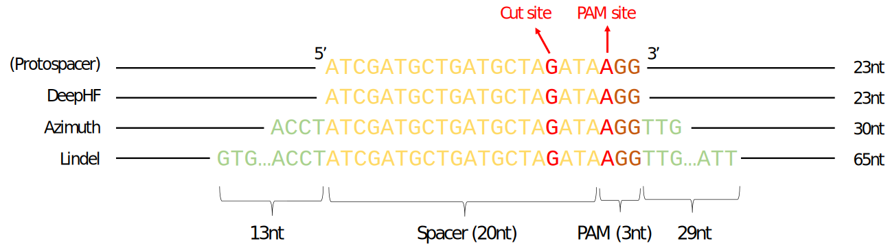
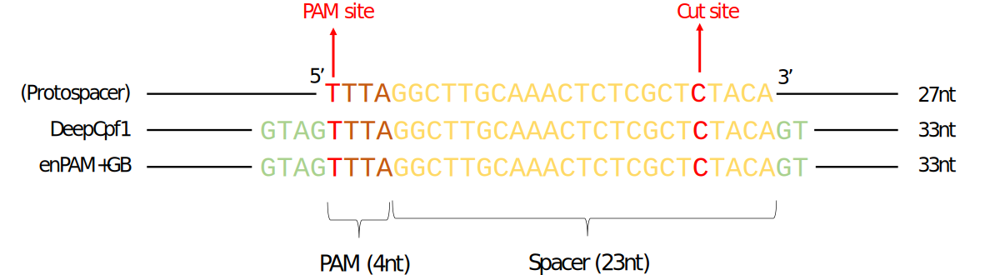

```{r, echo=FALSE, results="hide"}
options("knitr.graphics.auto_pdf"=TRUE)
```


# Overview of crisprScore

What makes a single-guide RNA (sgRNA) desirable for CRISPR-induced knockout?
It usually boils down to two criteria:

- Maximal on-target knockout efficiency (*it cuts efficiently where it should*)
- Minimal off-targeting effects (*it does not cut where it shouldn't*)

For both Cas9 and Cas12, several on-target and off-target scoring methods have
been developed to predict these characteristics from nucleotide content.
These methods have been made available through a heterogeneous array of software
packages, and therefore there is currently no easy way to easily apply all
methods at once to a set of sgRNAs. We provide in `crisprScore` a user-friendly
unified framework for both developers and users to score sgRNAs using
state-of-the-art algorithms. This is made possible by the use of the `basilisk`
package, an elegant and powerful R package that enables the management and use
of incompatible versions of Python modules in the course of a single R session. 

# Installation and getting started


When calling `testCrisprScore` for the first time after package installation,
all Python modules and conda environments needed for `crisprScore` will be
automatically downloaded and installed. This should take a few minutes. 

Note that RStudio users will need to add the following line to their `.Rprofile`
file in order for `crisprScore` to work properly:

```{r, eval=FALSE}
options(reticulate.useImportHook=FALSE)
```

The `scoringMethodsInfo` data.frame contains a succinct summary of scoring
methods available in `crisprScore`: 

```{r}
library(crisprScore)
data(scoringMethodsInfo)
print(scoringMethodsInfo)
```

See `?scoringMethodsInfo` for more information about the different columns. 

# On-targeting efficiency scores 

Predicting on-target cutting efficiency is an extensive area of research, and 
we try to provide in `crisprScore` the latest state-of-the-art algorithms as 
they become available. Different algorithms require different input nucleotide 
sequences to predict cutting efficiency as illustrated in the two
figures below. 


```{r, echo=FALSE,fig.cap="Sequence inputs for Cas9 scoring methods"}

```

```{r, echo=FALSE, fig.cap="Sequence inputs for Cas12a scoring methods"}

```


## Rule Set 1 (Cas9)

The Rule Set 1 algorithm is one of the first on-target efficiency methods
developed for the Cas9 nuclease [@ruleset1]. It generates a probability
(therefore a score between 0 and 1) that a given sgRNA will cut at its
intended target. 4 nucleotides upstream and 3 nucleotides downstream of
the protospacer sequence are needed for scoring:

```{r, eval=TRUE}
flank5 <- "ACCT" #4bp
spacer <- "ATCGATGCTGATGCTAGATA" #20bp
pam    <- "AGG" #3bp 
flank3 <- "TTG" #3bp
input  <- paste0(flank5, spacer, pam, flank3) 
results <- getRuleSet1Scores(input)
```

The Azimuth score described below is an improvement over Rule Set 1 
from the same lab.

## Azimuth score (Cas9)

The Azimuth algorithm is an improved version of the popular Rule Set 2 score for
the Cas9 nuclease [@azimuth]. It generates a probability (therefore a score 
between 0 and 1) that a given sgRNA will cut at its intended target.
4 nucleotides upstream and 3 nucleotides downstream of the protospacer 
sequence are needed for scoring:

```{r, eval=FALSE}
flank5 <- "ACCT" #4bp
spacer <- "ATCGATGCTGATGCTAGATA" #20bp
pam    <- "AGG" #3bp 
flank3 <- "TTG" #3bp
input  <- paste0(flank5, spacer, pam, flank3) 
results <- getAzimuthScores(input)
```

## DeepHF score (Cas9)

The DeepHF algorithm is an on-target cutting efficiency prediction algorithm for
several variants of the Cas9 nuclease [@deepcas9] using a recurrent neural 
network (RNN) framework. Similar to the Azimuth score, it generates a 
probability of cutting at the intended on-target. The algorithm only needs 
protospacer sequences as inputs:


```{r, eval=FALSE}
spacer  <- "ATCGATGCTGATGCTAGATA" #20bp
pam     <- "AGG" #3bp 
input   <- paste0(spacer, pam) 
results <- getDeepHFScores(input)
```

Users can specify for which Cas9 they wish to score sgRNAs by using the argument
`enzyme`: "WT" for Wildtype Cas9 (WT-SpCas9), "HF" for high-fidelity Cas9 
(SpCas9-HF), or "ESP" for enhancedCas9 (eSpCas9). For wildtype Cas9, users can
also specify the promoter used for expressing sgRNAs using the argument 
`promoter` ("U6" by default). See `?getDeepHFScores` for more details.


## DeepCpf1 score (Cas12a)

The DeepCpf1 algorithm is an on-target cutting efficiency prediction algorithm 
for the Cas12a nuclease [@deepcpf1] using a convolutional neural network (CNN) 
framework. It generates a score between 0 and 1 to quantify the likelihood of 
Cas12a to cut for a given sgRNA. 3 nucleotides upstream and 4 nucleotides 
downstream of the protospacer sequence are needed for scoring:


```{r, eval=FALSE}
flank5 <- "ACC" #3bp
pam    <- "TTTT" #4bp
spacer <- "AATCGATGCTGATGCTAGATATT" #23bp
flank3 <- "AAGT" #4bp
input  <- paste0(flank5, pam, spacer, flank3) 
results <- getDeepCpf1Scores(input)
```


## enPAM+GB score (enCas12a)

The enPAM+GB algorithm is an on-target cutting efficiency prediction algorithm 
for the enhanced Cas12a (enCas12a) nuclease [@enpamgb] using a gradient-booster
(GB) model. The enCas12a nuclease as an extended set of active PAM sequences in
comparison to the wildtype Cas12 nuclease [@encas12a], and the enPAM+GB 
algorithm takes PAM activity into account in the calculation of the final score.
It generates a probability (therefore a score between 0 and 1) of a given sgRNA 
to cut at the intended target. 3 nucleotides upstream and 4 nucleotides 
downstream of the protospacer sequence are needed for scoring:


```{r, eval=FALSE}
flank5 <- "ACC" #3bp
pam    <- "TTTT" #4bp
spacer <- "AATCGATGCTGATGCTAGATATT" #23bp
flank3 <- "AAGT" #4bp
input  <- paste0(flank5, pam, spacer, flank3) 
results <- getEnPAMGBScores(input)
```


# Off-target specificity scores 

For CRISPR knockout systems, off-targeting effects can occur when the CRISPR 
nuclease tolerates some levels of imperfect complementarity between gRNA spacer
sequences and protospacer sequences of the targeted genome. Generally, a greater
number of mismatches between spacer and protospacer sequences decreases the 
likelihood of cleavage by a nuclease, but the nature of the nucleotide
substitution can module the likelihood as well. Several off-target specificity
scores were developed to predict the likelihood of a nuclease to cut at an 
unintended off-target site given a position-specific set of nucleotide 
mismatches. 

We provide in `crisprScore` two popular off-target specificity scoring
methods for CRISPR/Cas9 knockout systems: the MIT score [@mit] and the
cutting frequency determination (CFD) score [@azimuth].

## MIT score 

The MIT score was an early off-target specificity prediction algorithm developed
for the CRISPR/Cas9 system [@mit]. It predicts the likelihood that the Cas9 
nuclease will cut at an off-target site using position-specific mismatch 
tolerance weights. It also takes into consideration the total number of 
mismatches, as well as the average distance between mismatches.
However, it does not take into account the nature of the nucleotide
substitutions. The exact formula used to estimate the cutting likelihood is

$$\text{MIT} = \biggl(\prod_{p \in
M}{w_p}\biggr)\times\frac{1}{\frac{19-d}{19}\times4+1}\times\frac{1}{m^2}$$

where $M$ is the set of positions for which there is a mismatch between the 
sgRNA spacer sequence and the off-target sequence, $w_p$ is an 
experimentally-derived mismatch tolerance weight at position $p$, $d$ is the 
average distance between mismatches, and $m$ is the total number
of mismatches. As the number of mismatches increases, the cutting 
likelihood decreases.  In addition, off-targets with more adjacent mismatches
will have a lower cutting likelihood. 

The `getMITScores` function takes as argument a character vector of 20bp 
sequences specifying the spacer sequences of sgRNAs (`spacers` argument), as 
well as a vector of 23bp sequences representing the protospacer sequences (20bp 
spacer + 3bp PAM sequence) of the putative off-targets in the targeted 
genome (`protospacers` argument). If only one spacer sequence is provided,
it will beused for all provided protospacers. 

The following code will generate MIT scores for 3 off-targets with respect to 
the sgRNA `ATCGATGCTGATGCTAGATA`:

```{r}
spacer   <- "ATCGATGCTGATGCTAGATA"
protospacers  <- c("ACCGATGCTGATGCTAGATAAGG",
                   "ATCGATGCTGATGCTAGATTAGG",
                   "ATCGATGCTGATGCTAGATAAGA")
getMITScores(spacers=spacer, protospacers=protospacers)
```


## CFD score 

The CFD off-target specificity prediction algorithm was initially developed for 
the CRISPR/Cas9 system, and was shown to be superior to the MIT score 
[@azimuth]. Unlike the MIT score, position-specific mismatch weights vary 
according to the nature of the nucleotide substitution (e.g. an A->G mismatch at
position 15 has a different weight than an A->T mismatch at position 15). 

Similar to the `getMITScores` function, the `getCFDScores` function takes as 
argument a character vector of 20bp sequences specifying the spacer sequences of
sgRNAs (`spacers` argument), as well as a vector of 23bp sequences representing
the protospacer sequences (20bp spacer + 3bp PAM sequence) of the putative 
off-targets in the targeted genome (`protospacers` argument). If only one spacer
sequence is provided, it will be used for all provided protospacers. 

The following code will generate CFD scores for 3 off-targets with respect to 
the sgRNA `ATCGATGCTGATGCTAGATA`:


```{r}
spacer   <- "ATCGATGCTGATGCTAGATA"
protospacers  <- c("ACCGATGCTGATGCTAGATAAGG",
                   "ATCGATGCTGATGCTAGATTAGG",
                   "ATCGATGCTGATGCTAGATAAGA")
getCFDScores(spacers=spacer, protospacers=protospacers)
```


# Indel prediction score 

## Lindel score (Cas9)

Non-homologous end-joining (NHEJ) plays an important role in double-strand break
(DSB) repair of DNA. Error patterns of NHEJ can be strongly biased by sequence 
context, and several studies have shown that microhomology can be used to 
predict indels resulting from CRISPR/Cas9-mediated cleavage. Among other useful 
metrics, the frequency of frameshift-causing indels can be estimated for a given
sgRNA. 

Lindel [@lindel] is a logistic regression model that was trained to use local
sequence context to predict the distribution of mutational outcomes. 
In `crisprScore`, the function `getLindelScores` return the proportion of 
"frameshifting" indels estimated by Lindel. By chance, assuming a random 
distribution of indel lengths, frameshifting proportions should be roughly 
around 0.66. A Lindel score higher than 0.66 indicates a higher than by chance
probability that a sgRNA induces a frameshift mutation. 

The Lindel algorithm requires nucleotide context around the protospacer 
sequence; the following full sequence is needed: 
[13bp upstream flanking sequence][23bp protospacer sequence]
[29bp downstream flanking sequence], for a total of 65bp. 
The function `getLindelScores` takes as inputs such 65bp sequences:

```{r, eval=FALSE}
flank5 <- "ACCTTTTAATCGA" #13bp
spacer <- "TGCTGATGCTAGATATTAAG" #20bp
pam    <- "TGG" #3bp
flank3 <- "CTTTTAATCGATGCTGATGCTAGATATTA" #29bp
input <- paste0(flank5, spacer, pam, flank3)
results <- getLindelScores(input)
```

```{r}
sessionInfo()
```

# References

